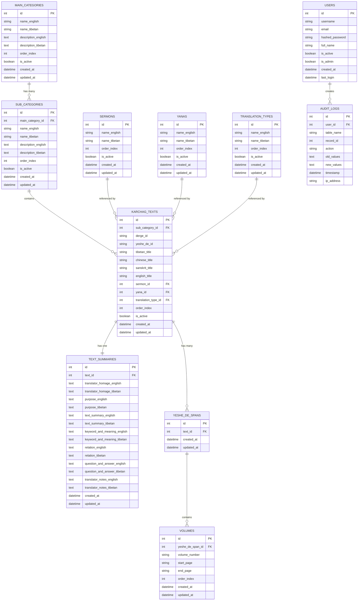

## 📊 ER Diagram

```mermaid
erDiagram
    MAIN_CATEGORIES {
        int id PK
        string name_english
        string name_tibetan
        text description_english
        text description_tibetan
        int order_index
        boolean is_active
        datetime created_at
        datetime updated_at
    }

    SUB_CATEGORIES {
        int id PK
        int main_category_id FK
        string name_english
        string name_tibetan
        text description_english
        text description_tibetan
        int order_index
        boolean is_active
        datetime created_at
        datetime updated_at
    }

    KARCHAG_TEXTS {
        int id PK
        int sub_category_id FK
        string derge_id
        string yeshe_de_id
        string tibetan_title
        string chinese_title
        string sanskrit_title
        string english_title
        int sermon_id FK
        int yana_id FK
        int translation_type_id FK
        int order_index
        boolean is_active
        datetime created_at
        datetime updated_at
    }

    TEXT_SUMMARIES {
        int id PK
        int text_id FK
        text translator_homage_english
        text translator_homage_tibetan
        text purpose_english
        text purpose_tibetan
        text text_summary_english
        text text_summary_tibetan
        text keyword_and_meaning_english
        text keyword_and_meaning_tibetan
        text relation_english
        text relation_tibetan
        text question_and_answer_english
        text question_and_answer_tibetan
        text translator_notes_english
        text translator_notes_tibetan
        datetime created_at
        datetime updated_at
    }

    YESHE_DE_SPANS {
        int id PK
        int text_id FK
        datetime created_at
        datetime updated_at
    }

    VOLUMES {
        int id PK
        int yeshe_de_span_id FK
        string volume_number
        string start_page
        string end_page
        int order_index
        datetime created_at
        datetime updated_at
    }

    SERMONS {
        int id PK
        string name_english
        string name_tibetan
        int order_index
        boolean is_active
        datetime created_at
        datetime updated_at
    }

    YANAS {
        int id PK
        string name_english
        string name_tibetan
        int order_index
        boolean is_active
        datetime created_at
        datetime updated_at
    }

    TRANSLATION_TYPES {
        int id PK
        string name_english
        string name_tibetan
        int order_index
        boolean is_active
        datetime created_at
        datetime updated_at
    }

    USERS {
        int id PK
        string username
        string email
        string hashed_password
        string full_name
        boolean is_active
        boolean is_admin
        datetime created_at
        datetime last_login
    }

    AUDIT_LOGS {
        int id PK
        int user_id FK
        string table_name
        int record_id
        string action
        text old_values
        text new_values
        datetime timestamp
        string ip_address
    }

    %% Relationships
    MAIN_CATEGORIES ||--o{ SUB_CATEGORIES : "has many"
    SUB_CATEGORIES ||--o{ KARCHAG_TEXTS : "contains"
    KARCHAG_TEXTS ||--|| TEXT_SUMMARIES : "has one"
    KARCHAG_TEXTS ||--o{ YESHE_DE_SPANS : "has many"
    YESHE_DE_SPANS ||--o{ VOLUMES : "contains"
    SERMONS ||--o{ KARCHAG_TEXTS : "referenced by"
    YANAS ||--o{ KARCHAG_TEXTS : "referenced by"
    TRANSLATION_TYPES ||--o{ KARCHAG_TEXTS : "referenced by"
    USERS ||--o{ AUDIT_LOGS : "creates"
```
